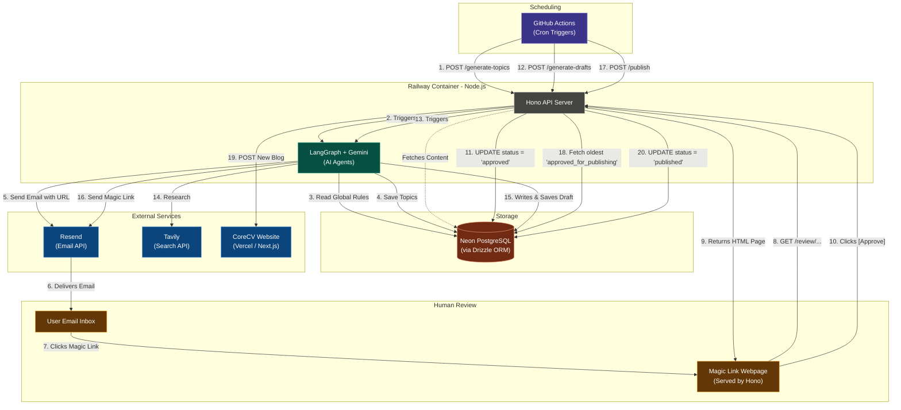

# CoreCV Blog Agent Architecture

This diagram illustrates the complete, updated architecture we designed. It highlights the GitHub Actions scheduling, the Railway/Hono backend, the Neon database, the LangGraph + Gemini agent interactions, and the Magic Link human review process.

